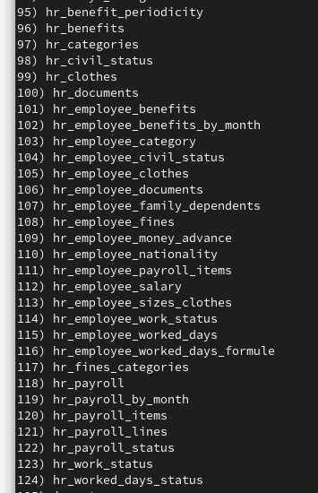

# hr
Human Resource Management

## Dependencies

Requires magic_php installed


## Install 

```
cd /var/www/html/magia_php/consola

php mago.php

```


In the list, choose one of the modules with the prefix `hr_` and enter until you finish with all

go to: 

http://localhost/magia_php/index.php?c=hr_clothes : to manage `hr_clothes` and so on with the rest


